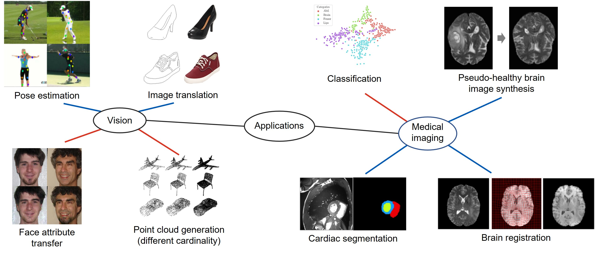

# A tutorial on learning disentangled representations in the imaging domain


Visual summary of disentangled representation learning applications in the computer vision (left) and medical imaging (right) domains. Red connections indicate vector-based disentanglement, while blue connections indicate tensor/vector-based one (CSD). **The visual examples are taken from the papers and repositories of the applications that are reported in the Tables below.**

## Applications of Disentanglement
Exemplar methods that exploit disentanglement to improve challenging tasks in computer vision and medical image analysis.

### Computer Vision

For each application we denote the type of disentanglement as either "Vector" or content-style "C-S".

|     Task     | Model Abbrev. | Paper (link to PDF) | Repository | Framework | Type | Original Implementation |
|:------------:|:------:|:--------:|:--------:|:------:|:------:|:------:|
|I2I translation|MUNIT|[pdf](https://openaccess.thecvf.com/content_ECCV_2018/papers/Xun_Huang_Multimodal_Unsupervised_Image-to-image_ECCV_2018_paper.pdf) |[repo](https://github.com/NVlabs/MUNIT) |PyTorch| C-S |<ul><li>- [x] </li>   |
|Face Attribute Transfer|ELEGANT|[pdf](https://openaccess.thecvf.com/content_ECCV_2018/papers/Taihong_Xiao_ELEGANT_Exchanging_Latent_ECCV_2018_paper.pdf) |[repo](https://github.com/Prinsphield/ELEGANT)  |PyTorch| Vector |<ul><li>- [x] </li> |
|Pose Estimation| n/a |[pdf](https://openaccess.thecvf.com/content_CVPR_2019/papers/Lorenz_Unsupervised_Part-Based_Disentangling_of_Object_Shape_and_Appearance_CVPR_2019_paper.pdf) |[repo](https://github.com/CompVis/unsupervised-disentangling)  |TensorFlow| C-S |<ul><li>- [x] </li> |
|Point cloud Generation|SetVAE|[pdf](https://openaccess.thecvf.com/content/CVPR2021/papers/Kim_SetVAE_Learning_Hierarchical_Composition_for_Generative_Modeling_of_Set-Structured_Data_CVPR_2021_paper.pdf) |[repo](https://github.com/jw9730/setvae)  |PyTorch| Vector |<ul><li>- [x] </li> |

  
  
  
### Medical Image Analysis
  
For each application we denote the type of disentanglement as either "Vector" or content-style "C-S".
  
|     Task     | Model Abbrev. | Paper (link to PDF) | Repository | Framework | Type | Original Implementation |
|:------------:|:------:|:--------:|:--------:|:------:|:------:|:------:|
|Single-modal Segmentation|SDNet|[pdf](https://arxiv.org/pdf/1903.09467v3.pdf) |[repo](https://github.com/vios-s/anatomy_modality_decomposition) |Keras|C-S |<ul><li>- [x] </li>   |
|Brain Synthesis|n/a|[pdf](https://arxiv.org/pdf/2005.01607.pdf) |[repo](https://github.com/vios-s/pseudo-healthy-synthesis)  |Keras| C-S |<ul><li>- [x] </li> |
|Causal Image Synthesis| n/a |[pdf](https://proceedings.neurips.cc/paper/2020/file/0987b8b338d6c90bbedd8631bc499221-Paper.pdf) |[repo](https://github.com/biomedia-mira/deepscm)  |PyTorch| C-S |<ul><li>- [x] </li> |
|Classification|MIDNET|[pdf](https://arxiv.org/pdf/2011.00739.pdf) |[repo](https://github.com/qmeng99/mutual-information-based-disentangled-neural-networks)  |Tensorflow| Vector |<ul><li>- [x] </li> |

Note that the **SDNet** model has also been implemented in PyTorch and has been integrated into the [GaNDLF](https://github.com/CBICA/GaNDLF) framework.

  
  
  
  
## Metrics
  
Measuring disentanglement in single vector latent variables:
  
|     Property     | Paper (link to PDF) | Repository |
|:------------:|:------:|:--------:|
|     Modularity     | [pdf](https://papers.nips.cc/paper/2018/file/1ee3dfcd8a0645a25a35977997223d22-Paper.pdf) <br> [pdf](https://openreview.net/pdf?id=By-7dz-AZ) <br> [pdf](https://arxiv.org/pdf/1812.02230.pdf) | [repo](https://github.com/rtqichen/beta-tcvae) <br> [repo](https://github.com/cianeastwood/qedr) <br> [repo](https://github.com/google-research/disentanglement_lib) |
|     Compactness     | [pdf](https://papers.nips.cc/paper/2018/file/1ee3dfcd8a0645a25a35977997223d22-Paper.pdf) <br> [pdf](https://openreview.net/pdf?id=By-7dz-AZ) <br> [pdf](https://arxiv.org/pdf/1812.02230.pdf) | [repo](https://github.com/rtqichen/beta-tcvae) <br> [repo](https://github.com/cianeastwood/qedr) <br> [repo](https://github.com/google-research/disentanglement_lib) |
|     Linear separability     | [pdf](https://openaccess.thecvf.com/content_CVPR_2019/papers/Karras_A_Style-Based_Generator_Architecture_for_Generative_Adversarial_Networks_CVPR_2019_paper.pdf) | [repo](https://github.com/NVlabs/stylegan) |
|     Explicitness     | [pdf](https://openreview.net/pdf?id=By-7dz-AZ) <br> [pdf](https://arxiv.org/pdf/1812.02230.pdf) | [repo](https://github.com/cianeastwood/qedr) <br> [repo](https://github.com/google-research/disentanglement_lib) |
|     Consistency & Restrictiveness      | [pdf](https://openreview.net/pdf?id=HJgSwyBKvr) | [repo](https://github.com/google-research/google-research/tree/master/weak_disentangle) |


  
  
  
Measuring disentanglement between two latent variables of the same or different dimensionality:
  
|     Metric   | Paper (link to PDF | Repository |
|:------------:|:------:|:--------:|
|     Distance Correlation & Information over Bias  | [pdf](https://arxiv.org/pdf/2008.12378.pdf) | [repo](https://github.com/vios-s/CSDisentanglement_Metrics_Library) |
| Kernel-target alignment | [pdf](https://proceedings.neurips.cc/paper/2001/file/1f71e393b3809197ed66df836fe833e5-Paper.pdf) | [repo](https://github.com/djsutherland/hsfuap/blob/master/hsfuap/kernels/alignment.py) |
| Hilbert-Schmidt independence criterion | [pdf](http://www.gatsby.ucl.ac.uk/~gretton/papers/GreBouSmoSch05.pdf) | [repo](https://github.com/amber0309/HSIC) |

## Citation
  
 ```
@misc{liu2021tutorial,
  author       = "Xiao Liu and Pedro Sanchez and Spyridon Thermos and Alison O'Neil and Sotirios A. Tsaftaris",
  title        = "A tutorial on learning disentangled representations in the imaging domain",
  year         = "2021"
}
```
  
